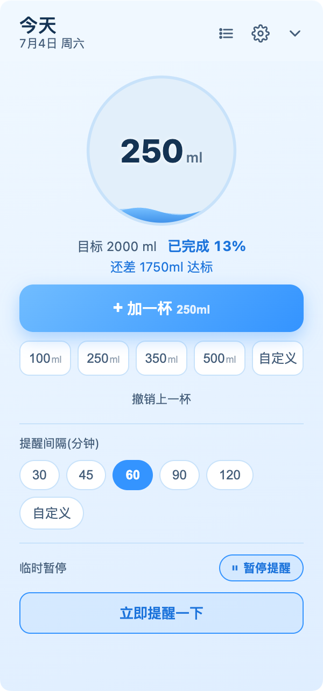
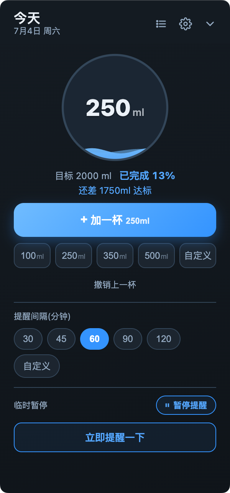
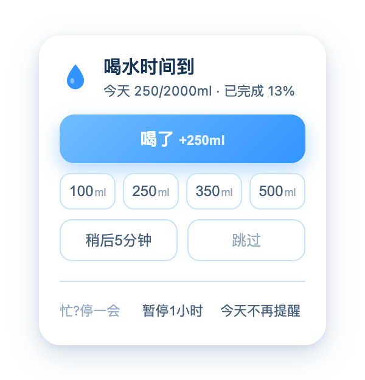
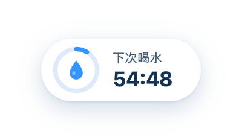
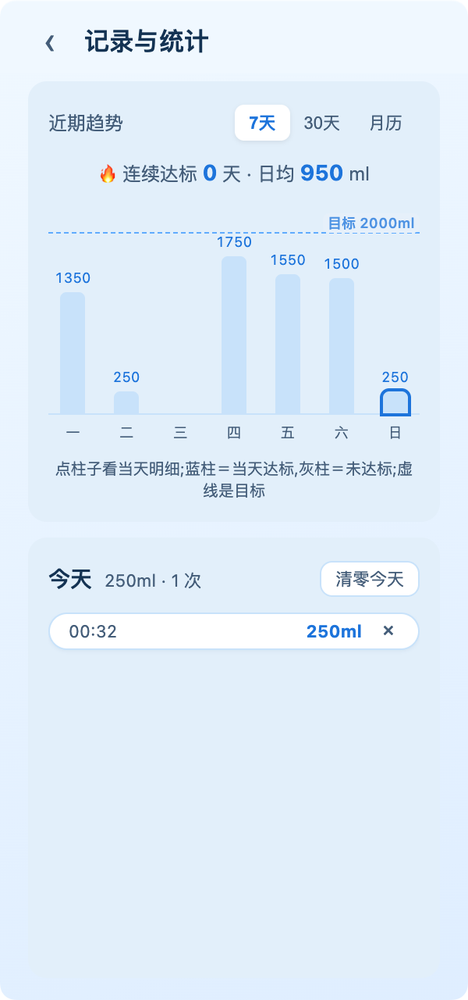
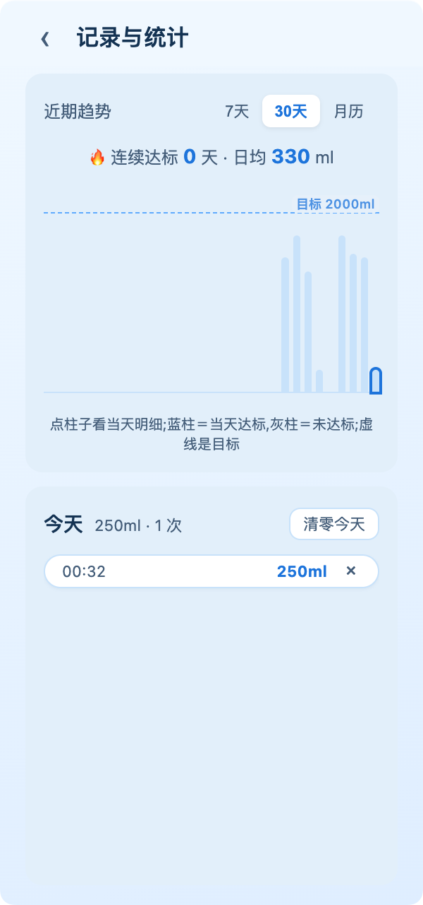
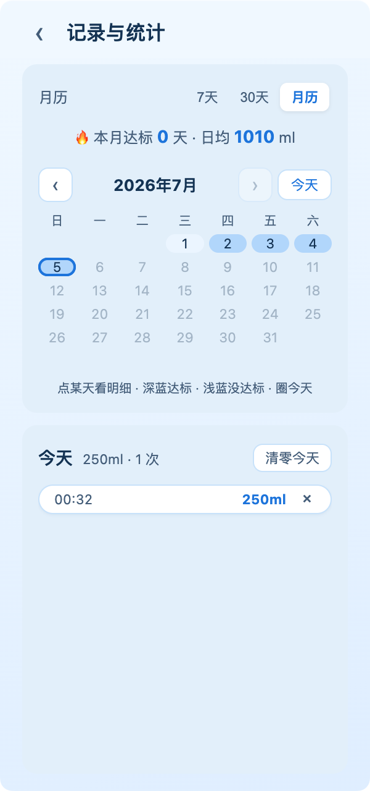
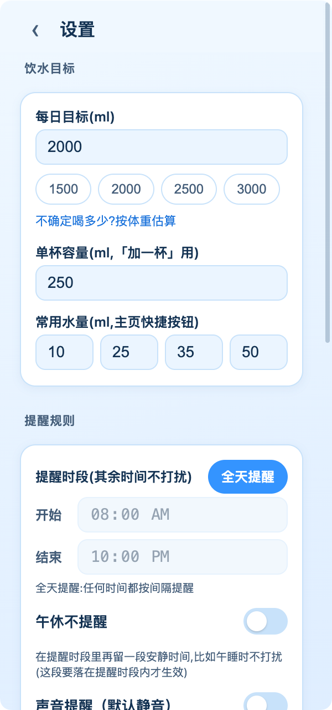
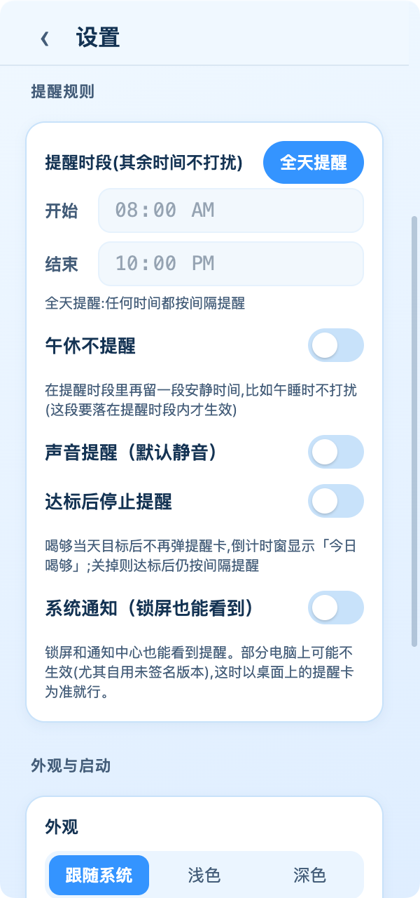
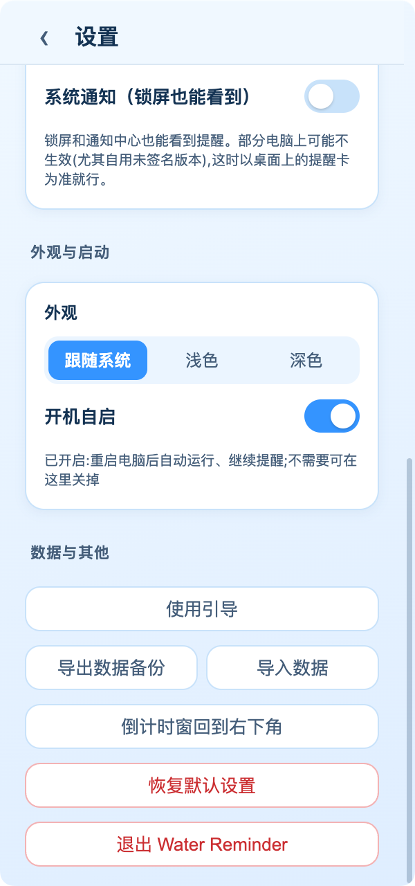

# 喝水小助手 (Water Reminder)

> 轻提醒的桌面级喝水小助手。屏幕角落常驻一颗倒计时胶囊,到点在角落安静浮出提醒卡,一键记录、可跳过、可稍后。简约 UI,丝滑非线性动效,跨所有桌面与全屏应用之上始终可见。目前提供 macOS 版。

## 界面

主面板(浅色 / 深色)· 提醒卡 · 常驻倒计时胶囊:

| 主面板 · 浅色 | 主面板 · 深色 | 提醒卡 | 倒计时胶囊 |
|:--:|:--:|:--:|:--:|
|  |  |  |  |

记录与统计(7 天趋势 / 30 天趋势 / 月历热力图):

| 7 天趋势 | 30 天趋势 | 月历 |
|:--:|:--:|:--:|
|  |  |  |

设置(可滚动,分三屏:饮水目标 / 提醒规则 / 外观与数据):

| 饮水目标 | 提醒规则 · 外观 | 启动 · 数据 |
|:--:|:--:|:--:|
|  |  |  |

## 功能

- **常驻倒计时胶囊**:屏幕角落一颗小药丸,显示距下次喝水的倒计时环 + mm:ss,可拖拽换位,点击展开主面板。四态:下次喝水 / 午休时段 / 该喝水啦 / 今天达标。
- **安静提醒卡**:倒计时走完,在胶囊旁 spring 弹性浮出一张提醒卡,不响铃、不抢焦点。三个动作 —— 喝了(记一杯并重置倒计时)/ 稍后 5 分钟 / 跳过。
- **一直在场**:主面板、胶囊、提醒卡都跨所有桌面(Space)、在全屏应用之上也可见 —— 无论在哪个屏幕、哪个全屏 app 里工作都看得到、都会被提醒。
- **每日饮水记录**:一键加一杯或选快捷量,水球实时进度可视化,可设每日目标与杯量。
- **记录与统计**:近 7 / 30 天柱状趋势(柱顶标当天量、虚线标目标)、**月历热力图**(格子颜色表示每天达标/未达标,可翻月、跳任意年月、回到今天)、连续达标天数、日均。点某天看当天逐笔明细,可删除、可撤销。
- **深色模式**:跟随系统,或手动固定浅色 / 深色。
- **提醒规则**:自定义提醒间隔、提醒时段(如 9:00–22:00)、午休不提醒时段;可临时暂停(限时自动恢复);达标后可选停止提醒。
- **数据本地化**:导入 / 导出 JSON,单机本地存储,无外部服务、无账号、无凭证。
- **常驻后台**:macOS 菜单栏顶部常驻,开机自启可选。

## 直接使用(macOS)

> 自用阶段未做付费代码签名,首次打开需手动放行一次(之后正常双击)。

1. 打开 `release/` 里的 `Water Reminder-<版本>-universal.dmg`,把 **Water Reminder** 拖进「应用程序」。
2. 首次打开:在「应用程序」里 **右键(或 Control + 点击)** Water Reminder 图标 → **打开** → 弹窗里再点一次 **打开**(绕过 Gatekeeper)。
3. 它是菜单栏常驻应用(无 Dock 图标)。打开后看**屏幕右上角菜单栏图标**和**屏幕角落的倒计时胶囊**;点胶囊或菜单栏图标展开主面板。

dmg 是通用包,Intel 与 Apple Silicon 两种 Mac 都能跑。

## 从源码运行 / 打包

```bash
npm install
# 若本机 npm 的 allow-scripts 白名单拦了 Electron 的 postinstall(二进制下载),
# npm run dev 起不来时手动补一次:
node node_modules/electron/install.js

npm run dev      # 开发模式,热更新,起后屏幕角落出现胶囊
npm run build    # 仅编译到 out/
npm run dist     # 编译 + electron-builder 出当前架构的 Mac .dmg(在 release/)

# 出通用包(同时兼容 Intel 与 Apple Silicon):
npx electron-builder --mac dmg --universal
```

## 技术栈

- **Electron**:桌面外壳,主进程负责托盘、通知、开机自启、窗口管理、数据持久化
- **electron-vite**:构建 + 开发热更新
- **TypeScript**:主进程与渲染进程都用
- **渲染层**:vanilla TS + CSS,不引入前端框架(UI 简单、动效更可控)。进度环、趋势图、月历为手写 SVG / CSS;弹性动效用 Web Animations API
- **electron-store**:数据以 JSON 存于系统 userData 目录,单机本地
- **electron-builder**:出 macOS(.dmg)

## 关于跨平台

代码按跨平台写(常驻位置、通知、字体 fallback 都按平台分别做了适配),但**目前只在 macOS 上构建与真机验收;Windows 版尚未打包、未在真机验证**,所以本仓库只提供 macOS 版。后续若补 Windows,`electron-builder` 已具备一份配置出双端的能力。

数据位置:Electron userData 目录(macOS 在 `~/Library/Application Support/water-reminder`)。覆盖安装 app 不影响已有数据。
